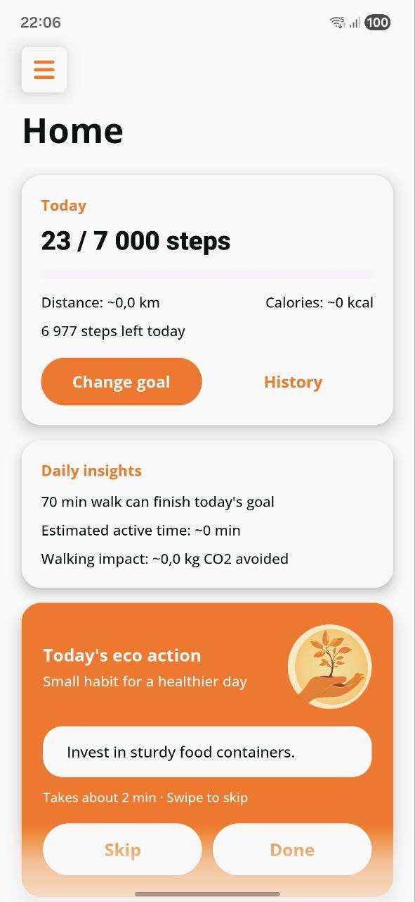
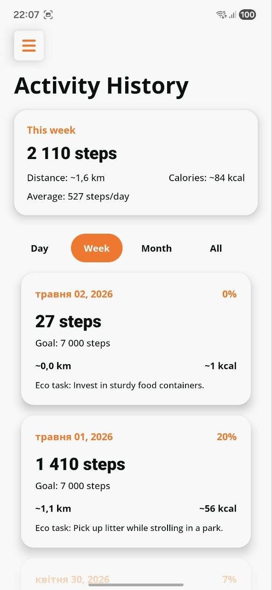
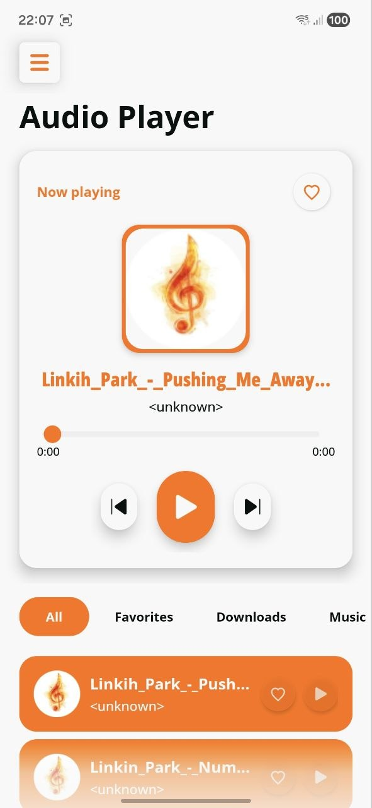
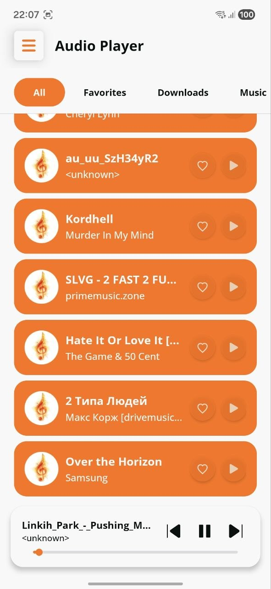
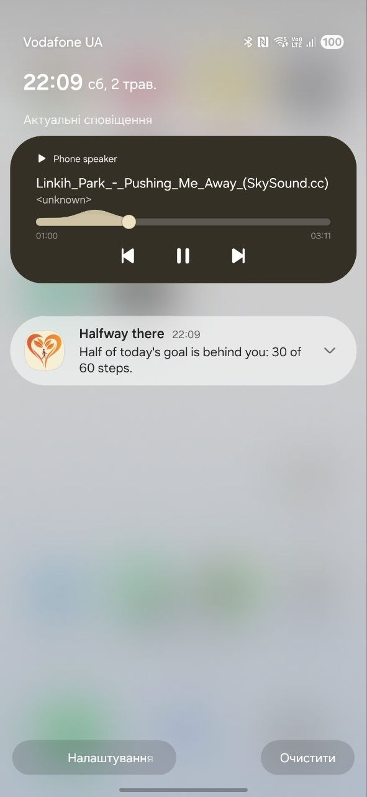

# SustainStep

SustainStep is a personal Android project I originally built some time ago and recently revisited to make it more polished and portfolio-ready.

The app combines daily step tracking, activity history, eco tasks, and a local music player. During the latest iteration I focused on moving important work out of the UI layer, improving background behavior, integrating with Android system features, and refreshing the main screens with modern collapsing layouts.

## Highlights

- Background step tracking with a `ForegroundService` and `SensorManager`
- Step goal milestone notifications for 50%, 75%, and 100% of the daily goal
- Background audio playback with a dedicated media playback service
- Lock-screen and notification media controls via `MediaSessionCompat`
- Audio focus handling, so playback pauses correctly during calls or interruptions
- Local music library loaded from `MediaStore`
- Music filters for folders, recently added tracks, and favorites
- Activity history with daily step summaries, distance, calories, and goal progress
- Swipe-to-delete for history items
- Modern collapsing headers across the main screens using `CoordinatorLayout`, `AppBarLayout`, and `CollapsingToolbarLayout`

## Demo

  

The demo shows the audio player flow: starting playback, collapsing the player header, showing the mini player, and using system media controls.

## Screenshots

  
  
  

  
  

## What I Improved

The original project was a simpler Android app. I upgraded it with production-style Android behavior and a more presentation-ready UI.

### Step Tracking

Step counting was moved into `StepTrackingService`, a foreground service that can keep tracking activity while the app is not visible. The implementation uses `Sensor.TYPE_STEP_DETECTOR`, stores daily progress locally, and updates the UI through repository state.

I also added milestone notifications so the user gets feedback when they reach 50%, 75%, and 100% of the daily step goal. Each milestone is shown only once per day.

### Music Playback

Music playback was moved into `AudioPlaybackService`, allowing audio to continue when the app is closed or in the background. The service exposes playback controls through a media notification and `MediaSessionCompat`, so the user can control playback from the lock screen, notification shade, or headset buttons.

The player also handles audio focus changes, including pausing playback during phone calls.

### UI and UX

I redesigned the main screens around collapsing headers similar to modern Android apps. The Home, History, and Audio Player screens use `CoordinatorLayout`, `AppBarLayout`, and `CollapsingToolbarLayout` with smooth title transitions and scroll-driven UI behavior.

The audio screen also includes an expanded player, a collapsed mini-player state, folder filters, favorite tracks, and automatic queue navigation.

### Activity History

The History screen was changed from a simple completed-tasks list into a step activity history. It shows daily step count, goal progress, estimated distance, and calories. Users can filter the history by period and delete entries with a swipe gesture.

## Tech Stack

- Kotlin
- Android SDK
- MVVM
- ViewBinding
- Room
- Coroutines
- LiveData / StateFlow
- Foreground Services
- SensorManager
- MediaPlayer
- MediaSessionCompat
- NotificationCompat
- MediaStore
- CoordinatorLayout
- AppBarLayout
- CollapsingToolbarLayout

## Android APIs Used

- `SensorManager` and `TYPE_STEP_DETECTOR` for step tracking
- `ForegroundService` for background step counting and music playback
- `NotificationChannel` and `NotificationCompat` for system notifications
- `MediaSessionCompat` for lock-screen and headset media controls
- `AudioFocusRequest` for correct playback behavior during interruptions
- `MediaStore` for loading local audio files
- Runtime permissions for activity recognition, notifications, and audio access

## Project Status

This is a portfolio project, focused on demonstrating Android development skills: background services, media playback, system integrations, local persistence, runtime permissions, and polished UI behavior.

## Requirements

- Android Studio
- JDK 17
- Android SDK 35
- Minimum SDK 24

## Running the Project

1. Clone the repository.
2. Open the project in Android Studio.
3. Sync Gradle.
4. Run the `app` configuration on an emulator or physical device.

For step tracking and music playback features, grant the required runtime permissions when prompted.
